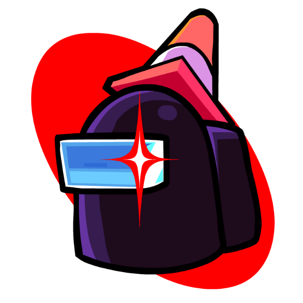

    

# Friday Night Funkin': Psych Engine

[Psych Engine](https://github.com/ShadowMario/FNF-PsychEngine) was originally made for the [Mind Games mod](https://gamebanana.com/mods/301107) with the aim to fix vanilla FNF's (circa 2021) issues, improve the casual experience, and be an easier alternative for newbie coders.

## Compiling:

Must have Haxe 4.3.4 or greater.

The setup files for Psych Engine's specific haxe libraries can be installed with the `install_haxelibs` files located in the `projFiles/setup` folder. The files are named after your operating system.

Refer to [Psych Engine's build instructions](https://github.com/ShadowMario/FNF-PsychEngine/blob/main/BUILDING.md).

## Original Funkin' team
- [ninjamuffin99](https://twitter.com/ninja_muffin99) - Programmer
- [PhantomArcade3K](https://twitter.com/phantomarcade3k) and [Evilsk8r](https://twitter.com/evilsk8r) - Art
- [Kawaisprite](https://twitter.com/kawaisprite) - Musician

## Engine Credits / Special Thanks
- [Shadow Mario](https://ko-fi.com/shadowmario) - Head Developer, Programmer.
- [Riveren](https://x.com/riverennn) - Main Artist.
- [bbpanzu](https://x.com/bbsub3) - Ex-Team Member (Programmer).
- [crowplexus](https://x.com/crowplexus) - HScript Iris, Input System v3, and Other PRs.
- [Kamizeta](https://www.instagram.com/cewweey/) - Creator of Pessy, Psych Engine's mascot.
- [MaxNeton](https://bsky.app/profile/maxneton.bsky.social) - Loading Screen Easter Egg Artist/Animator.
- [Keoiki](https://x.com/Keoiki_) - Note Splash Animations and Latin Alphabet.
- [SqirraRNG](https://x.com/gedehari) - Crash Handler and Base code for Chart Editor's Waveform.
- [EliteMasterEric](https://x.com/EliteMasterEric) - Crash Handler and Base code for Chart Editor's Waveform.
- [MAJigsaw77](https://x.com/MAJigsaw77) - .MP4 Video Loader Library (hxvlc).
- [Tahir Toprak Karabekiroglu](https://x.com/TahirKarabekir) - Note Splash Editor and Other PRs.
- [iFlicky](https://x.com/flicky_i) - Composer of Psync, Tea Time and some sound effects.
- [KadeDev](https://x.com/kade0912) - Fixed some issues on Chart Editor and Other PRs.
- [superpoers04](https://x.com/superpowers04) - LUA JIT Fork.
- [CheemsAndFriends](https://x.com/CheemsnFriendos) - Creator of FlxAnimate.
- [Ezhalt](https://x.com/_ezhaltd) - Pessy's Easter Egg Jingle.
- [MaliciousBunny](https://x.com/BunnyMalicious) - Video for the Final Update.